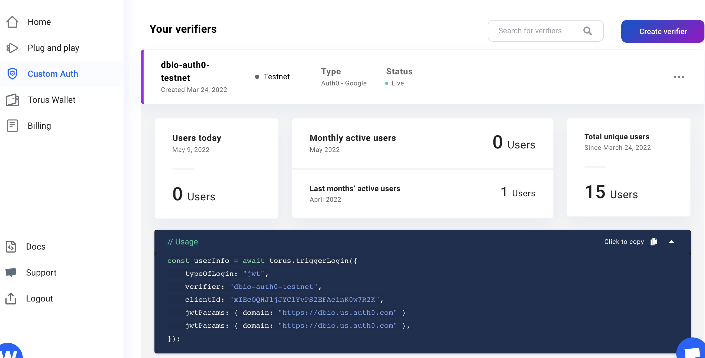

# dBio Client

The dBio Client is the user facing interface of the dBio system. All users (both patients and third party providers) must initially sign up for dBio through the client.

## Third Party SDKs
dBio uses the following third party SDKs
- **[Torus CustomAuth SDK](https://docs.tor.us/customauth/get-started)** - used to create an ethereum address and generate a private/public key pair for the user.
- **[Auth0 React SDK](https://auth0.com/docs/libraries/auth0-react)** - used for authentication. Generates a JWT that is used to retrieve a user's Torus key and to initialize the IronCore SDK.
- **[IronWeb Data Control Platform SDK](https://ironcorelabs.com/docs/data-control-platform/javascript/react/)** - [IronCore's](https://ironcorelabs.com/) SDK that is implemented for proxy re-encryption.

## Configuration and Future Development

Configuration constants can be found in the **_constants.js_** file.

For future developers, if you wish to build on this client or run it you will need to do a few things.

1. Create your own [Auth0](https://auth0.com/) application. Once this Auth0 application is created you will need you plug in your own Auth0 application domain and client id into the *AUTH0_DOMAIN* and *AUTH0_CLIENT_ID* variables in constants.js.
2. Note that in *constants.js* the verifier is configured for google. You need to make sure you verifier on your Auth0 application is configured as google as well.
3. The *BACKEND_ENDPOINT* constant is the URL address for the dBio protocol server.
4. You will need to setup a [Torus](tor.us) verifier. Register with Torus and under their "Custom Auth" tab in the dashboard you can create your own verifier. In the below image you can see I created a verifier that uses a JWT login, has a verifier-id (This is used in constants.js), my Auth0 client ID and finally the Auth0 domain.

## Running Locally

In the project directory, you can run:

### `npm start`

Runs the app in the development mode.\
Open [http://localhost:3000](http://localhost:3000) to view it in your browser.

The page will reload when you make changes.\
You may also see any lint errors in the console.

### `npm test`

Launches the test runner in the interactive watch mode.\
See the section about [running tests](https://facebook.github.io/create-react-app/docs/running-tests) for more information.

### `npm run build`

Builds the app for production to the `build` folder.\
It correctly bundles React in production mode and optimizes the build for the best performance.

The build is minified and the filenames include the hashes.\
Your app is ready to be deployed!

See the section about [deployment](https://facebook.github.io/create-react-app/docs/deployment) for more information.

### `npm run eject`

**Note: this is a one-way operation. Once you `eject`, you can't go back!**

If you aren't satisfied with the build tool and configuration choices, you can `eject` at any time. This command will remove the single build dependency from your project.

Instead, it will copy all the configuration files and the transitive dependencies (webpack, Babel, ESLint, etc) right into your project so you have full control over them. All of the commands except `eject` will still work, but they will point to the copied scripts so you can tweak them. At this point you're on your own.

You don't have to ever use `eject`. The curated feature set is suitable for small and middle deployments, and you shouldn't feel obligated to use this feature. However we understand that this tool wouldn't be useful if you couldn't customize it when you are ready for it.
